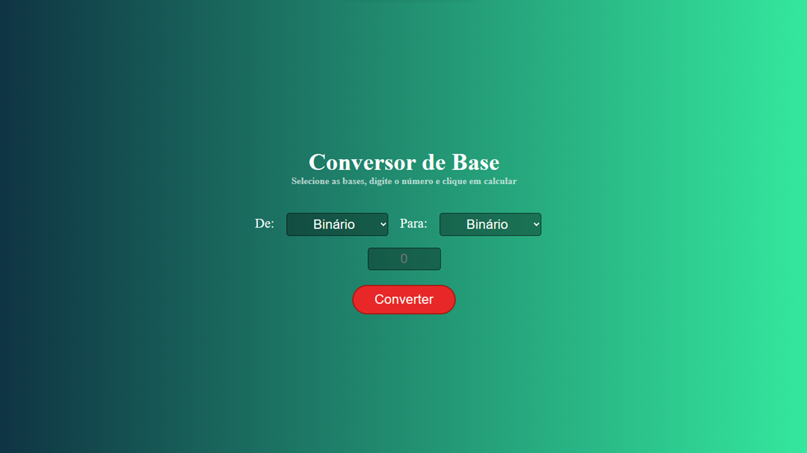
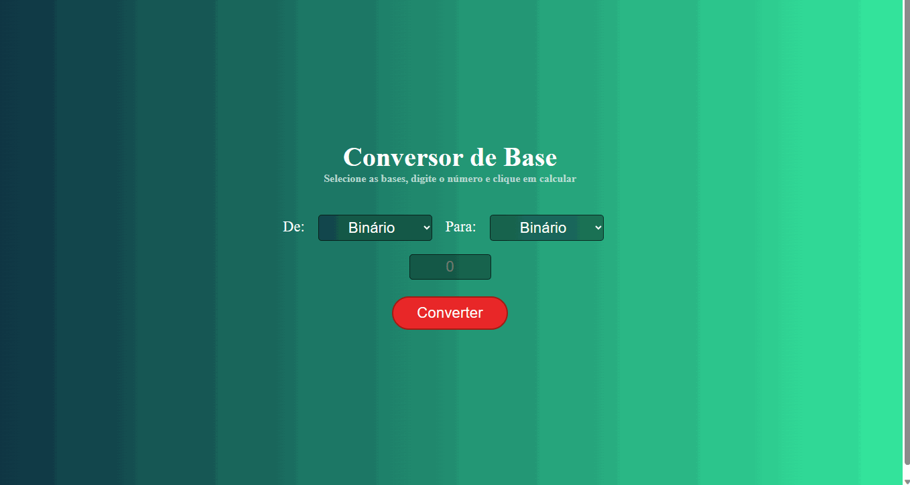

# Elevador

</img>
</img>

## 🤔 O que é este projeto

Este projeto é uma página feita com HTML, CSS e Javascript para demonstrar um conversor de bases. Ele possui inicialmente dois seletores de bases, um para a base atual e outro para o número da base a ser convertido. Abaixo temos um campo de input para indicar o número que se deseja converter.Quando o botão “Converter” é clicado a conversão é feita e logo abaixo surge um mostrador com o número da base atual com sua respectiva conversão. Este foi mais um projeto de integração entre as tecnologias citadas acima com a DOM do curso Formação DEV.

## 🖥️ Como rodar este projeto
Para rodar o projeto basta dar dois cliques no arquivo *index.html* uma vez que a pasta do projeto esteja aberta no sistema de arquivos do seu sistema operacional.

Alternativamente você também pode utilizar a extensão [Live Server](https://marketplace.visualstudio.com/items?itemName=ritwickdey.LiveServer) da IDE Visual Studio Code para rodar o projeto.

## 🕹️ Como usar este projeto
Uma vez que a aplicação esteja rodando, você pode digitar inicialmente no campo de input o valor que deseja que seja convertido. 

Em seguida, informar de qual base esse valor pertence. E no campo ao lado informar para que base deve este valor ser convertido.

Daí só clicar em converter. 

Abaixo aparecerá a impressão dos dois valores: o primeiro com a base informada e junto a ele um número na forma de subscrito indicando sua base inicial, o caractere  de igualdade “=”, e em seguida o valor convertido também junto a ele um número na forma de subscrito indicando para qual base ele foi convertido.

## ⚙️ Tecnologias usadas no projeto
- 
- 
- 

## 🗒️ Features do projeto
<!-- caracteristicas do projeto resumidas mas não é necessaria-->
- 1 campo de input onde o usuário insere o valor que deseja converter.
- 2 seletores o primeiro indica qual a base inicial e o segundo para que base deseja ser o valor convertido. 
- 1 botão para Converter. 
- 1 mostrador que vai aparecer os dois valores de forma de comparativa.

## 🗂️ Como este projeto está organizado
<!-- dar uma ideais geral nãoprecisa ser detalhista -->
Na pasta raiz do projeto existem três arquivos de código:
- index.html -> contém o html da aplicação
- estilo.css -> contém o arquivo de estilos da aplicação
- script.js -> contém os códigos javascript da aplicação para fazer a conversão e manipular o HTML

## 👩‍💻 Como este projeto foi implementado
<!-- Aqui pode ser usado uma linguagem, mas técnica e não escrever demais-->
Este projeto foi implementado com HTML, CSS e JavaScript.

Inicialmente para obter os elementos inseridos na página e podermos manipulá-los com o Javascript por meio da DOM utilizamos getElementById e  querySelector e armazenamos eles em constantes.

Adicionamos um evento addEventListener ao botão de “Converter” por meio de uma função para realizar a lógica da conversão e ao final mostrar o resultado na tela.

A lógica foi simples inicialmente armazenando em uma constante chamada numeroAtual, ou seja, número informado pelo usuário. 

Em uma outra constante numeroConvertido usamos função parseInt obtendo seus parâmetros tanto pelo número numeroAtual que é informado pelo usuário e no segundo parâmetro a baseAtual obtivemos pelo value indexado no HTML na tag option do seletor, pois quando o usuário selecionava para que base desejava converter esse já dentro do HTML tinha uma valor específico para ser usado pela função.

Para converter em inteiro o segundo parâmetro da função parseInt que era fornecido via  HTML criamos duas constante baseAtual e baseFinal que recebiam seletorBaseFinal.value acrescido de um “+” no início para sua conversão em inteiro.

Por fim, para imprimir o resultado final alterando o HTML usamos innerHTML, pois existia a necessidade de dentro da template string usar uma TAG `` para criar o subscrito das bases dos valores apresentados.

## ⭐ Dependências principais
<!-- API's importantes-->
Não existe dependências no projeto.

## 🆘 Precisa de ajuda?
Você pode me contatar através desses contatos:

-------

Feito com 🧑‍💻 por Marcelo

